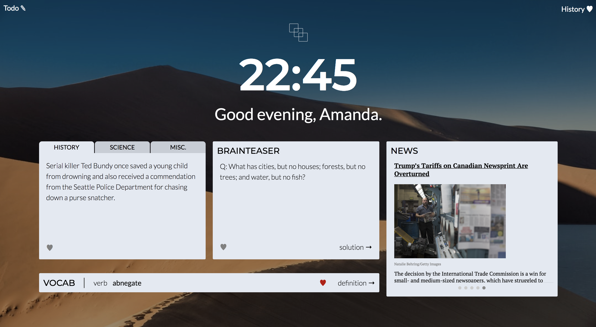

<p align="center"></p>

<h2 align="center">
  <a href="https://chrome.google.com/webstore/detail/snippet/folafpbldfpbbbjcchmgncheeidanfeg">Install from Chrome Store!</a>
</h2>

<h3 align="center">
  <a href="https://zamandalee.github.io/Snippet/">Demo Page</a>
</h3>

<p align="center">
  <a href="#background">Background</a> •
  <a href="#technologies">Technologies</a> •
  <a href="#features">Features</a> •
  <a href="#pending-features">Pending Features</a>
</p>
<br>

<p align="center"></p>

# Background
Snippet is the Chrome Web extension that fulfills the curiosity cravings of every lifelong learner.

Feel like you’ve hit a learning plateau? Want to be more well-rounded? Have you been looking for a convenient way to achieve this? Search no further! Snippet provides extracts of information from a variety of categories to appear whenever you open a new tab. From vocabulary to biology, Snippet has you covered with easy-to-digest learnings that will keep your mind fresh with knowledge.

# Technologies
- JavaScript
- JQuery
- Google Chrome API (Storage)
- Reddit API
- New York Times API
- Oxford Dictionary API
- Unsplash Image API
- HTML5/CSS3

# Features


### Favoriting Through History
Users can see all of their snippet history, organized in tabs, in the history modal.

Users can favorite snippets on on the main page and on the history modal by clicking the &hearts; button. They can then view their favorites in the "Favorites" tab.


This was achieved by fetching and updating data contained in Chrome Storage. Because snippets change daily, each date is a key. The corresponding value is an object containing snippet categories, the content of that category, whether or not it has been favorited, and other data.

 ```js
 // history.js, click handler for when favorite button is clicked
 function setFavoriteListener(itemFavoriteButton, category, date) {
   itemFavoriteButton.addEventListener( 'click', () => {

     chrome.storage.sync.get(date, ret => {
       if ( ret[date][category].favorited ) {
           itemFavoriteButton.classList.remove('favorited');
           ret[date][category].favorited = false; //changing the value of whether or not snippet is favorited
           chrome.storage.sync.set({[date]: ret[date]});
       } else {
         itemFavoriteButton.classList.add('favorited');
         ret[date][category].favorited = true;
         chrome.storage.sync.set({[date]: ret[date]});
       }
     });
   });
 }
 ```

### Flipping
When clicked, the Vocab and Brainteaser snippets flip, simulating a flashcard.


```css
/* css/vocabSnippet.css */
.riddle-flipper {
  transform: rotateY(180deg);
}

.riddle-front, .riddle-back {
  display: flex;
  backface-visibility: hidden;
  background: #e3e9f2;
  transition: color 2s;
}

.riddle-front {
  transform: rotateY(0deg);
  z-index: 3;
}

.riddle-back {
  transform: rotateY(180deg);
  z-index: 3;
}
```

To render an animation where the snippet box itself is rotated as well as the text, a setTimeout was employed to set a background color:
```js
setTimeout(() => {
  riddleFlipper.classList.toggle('background');
}, 200);
```

### Carousel
Upon fetching the top news stories from NYTimes, they transition automatically, and can be controlled with the •••••.


```js
function carousel() {
  const articles = document.getElementsByClassName("news-article");
  const dots = document.getElementsByClassName("dot");

  if (slideIndex > articles.length) {
    slideIndex = 0;
  }

  for (let i = 0; i < articles.length; i++) {
     articles[i].style.display = "none";
  }

  slideIndex++;

  if (slideIndex > articles.length) {
    slideIndex = 1;
  }

  for (let i = 0; i < dots.length; i++) {
    dots[i].className = dots[i].className.replace(" active", "");
  }

  articles[slideIndex - 1].style.display = "block";
  dots[slideIndex - 1].className += " active";
}
```

### API Calls
Example of one of the API calls used:
```js
// background.js
chrome.runtime.onMessage.addListener((request, sender, sendResponse) => {
  switch( request.type ) {
    case 'getVocabWord':
      $.ajax({
        url: `https://od-api.oxforddictionaries.com/api/v1/entries/en/${request.word}`,
        method: 'GET',
        headers: {
          'app_id': 'xxxxxa8c',
          'app_key': 'xxxxxxxxxxxxxxxxxxxxxxxxxxxxx0ba'
        },
      }).done( result => {
        sendResponse({result: result.results[0]});
      });
  }
  return true;
});
```

# Pending Features
- News snippet: include a dropdown for National, Business, Tech, etc. categories
- Search functionality in history
- Order the history to move favorites up to the top
- Preferences: when page loads for first time, allow users to choose which snippets to be on page
- Backend: supplies all subscribed users with same daily snippet data
